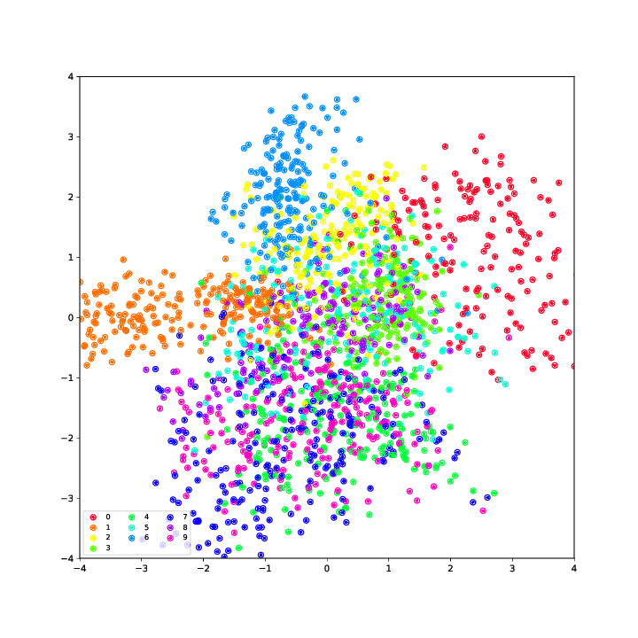
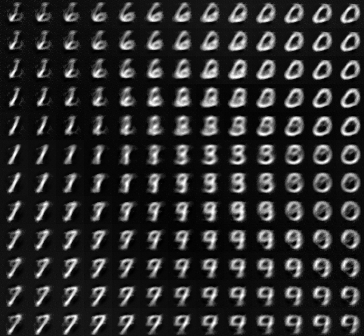

# Variational Autoencoder Integration into Darknet

Integration of an Autoencoder and  **Variational Autoencoder (VAE)** into the Darknet neural network framework. General information about VAEs, [Auto-Encoding Variational Bayes](https://arxiv.org/abs/1312.6114).

## VAE, Training and Generation
For training use:
```sh
./darknet vae train [cfg] [train_file] [-weights weight_file (optional)] [-N (optional)] [-output output_file (optional)]
```

* `cfg` name of network architecture cfg-file to be used for training
* `train_file` unlabeled dataset in csv format to be trained from (rows = examples; cols = features)
*  `weight_file` load weights from former training into network before training (weight file is generated after finishing training `vae.weights`)
*  `output_file` name of file to save 10 inputs and outputs of the network after each epoch in (can be used to visualize training process, see [training_analysis.ipynb](./jupyter-notebooks/training_analysis.ipynb))

For generation use:
```sh
./darknet vae sample [cfg] [latent_vector_file] -[weights weight_file] [-output output_file (optional)]
```
* `latent_vector_file` csv-format file with latent vectors in it which should be used to generate samples (row = latent_vector, col = latent variables)

## VAE, Network architecture (cfg-file):
Has to have at least following layers:
```ini
...encoder stuff..

[connected]
output=2
activation=linear

[route]
layers=-2

[connected]
output=2
activation=linear

[route]
layers=-1,-3

[sampling]
beta=0.5

..decoder stuff..

[cost]
type=sse
```

First connected layer for mean variables, second for variance variables. In this example latent_vector has size 2. Both connected layers are input of sampling layer which samples from normal distribution with that inputs. Sampling layer can have an optional beta parameter to weight influence of latent_loss to total loss (default 0.5). Cost layer at the end to calculate image loss of loss function.

## VAE, results

Training with [vae_connected.cfg](./cfg/vae_connected.cfg) aka 10 epochs over 4000 mnist training images results in a latent loss of 4.4 and an image loss of 38.2. Visualization of outputs using `-output` and [training_analysis.ipynb](./jupyter-notebooks/training_analysis.ipynb):


<br>
Visualization of latent space with 2 latent variables (x, y).

<br>
<br>
Visualization of samples generated from -3 to 3 for both latent variables.

The images of course are not too sharp and distinct because latent loss and image loss are relatively high compared to improved convolutional models, but it was enough for my developing and testing purposes.

## Run Autoencoder only
```sh
./darknet autoencoder [cfg] [train_file] -[weights weight_file (optional)] [-output output_file (optional)]
```

## Implementation background
Major changes to library (darknet):
* Changed `darknet.c`: added command line entry to run autoencoder
* Added `autoencoder.c`: entry point for autoencoder and vae (run_autoencoder)
* Added `sampling_layer.c`: new layer to sample from normal distribution with mean and variance from the two previous connected layers during forwardprop, adds additional derivatives of latent_loss to net.delta during backprop

# Darknet #
Darknet is an open source neural network framework written in C and CUDA. It is fast, easy to install, and supports CPU and GPU computation.

For more information see the [Darknet project website](http://pjreddie.com/darknet).

For questions or issues please use the [Google Group](https://groups.google.com/forum/#!forum/darknet).
